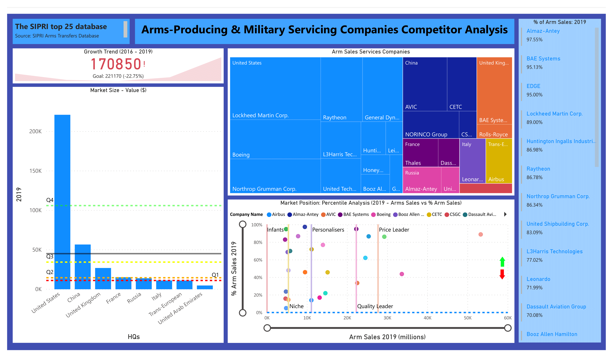

# Arms Producing and Military Servicing Competitors' Analysis
Hey! Welcome to my Arms Producing and Military Servicing Company Market Analysis repository. This visualization provides an overview of global imports growth, market size of top global importers. Furthermore, the viz provides a market positioning analysis which can be used by players in the market to; (a) identify their positioning among global players (b) see where global players stand i.e. if they are market leaders or serve a niche or if they are just starting to grow or focus emphasis on personalization. 
#### Parameters for Insight Generation
The market positioning is determined through plotting total arm sales ($) versus their arms sales (%) to sort competitors in categories namely; 
 - Infants: competitors with sales volume falling under Quartile 1.
 - Niche: competitors with sales volume falling under Quartile 2.
 - Personalizers: competitors with sales volume falling under Quartile 3.
 - Price Leader: competitors with sales volume falling under Quartile 4.
  

 
## Top 25 Global Players - Market Outlook
An overall trend shows a 22.75% decline in Arm Imports from 2016-2019. As geopolitical uncertainty increase, states look to increase national sovereignty in defense capabilities. This might be an underlying reason to the pattern in imports. For example; Saudi Arabia, a nation heavily relying on imports under its Vision 2030 looks forward to achieving national sovereingty over its military goods and services by 50%.

### Market Leaders (Volume Sales)
- United States, China, and the United Kingdom are top global suppliers.
- France and Russia fall under the the Q2- 2nd Quartile. 
- Italy and Trans-Europe fall under the Q1- 1st Quartile.
### Market Position Analysis
- Lockheed Martin Corp. and Northrop Grumman Corp. are Price Leaders. 
- Raytheon and General Dynamics Corp. are Quality Leaders.
- Almaz-Antey, Huntington Ingalls Industries, Dassault Aviation Group offer arm products to the Customised/Personalised Service Markets.
- BAE Systems is a Quality Leader and provide offerings to the Customised/Personalised Service Markets.
- EDGE, United Shipbuilding Crop., Booz Allen Hamilton are in their infancy and have the potential for high growth.
### Unclear strategy or Core vs. Critical Business Units?
Other notable suppliers with a low % Arms Sales but high Arm Sales in 2019 include;
- Boeing is a Price leader.
- AVIC is a Quality Leader.
- CETC, NORINCO Group, and United Technology Group provide offerings to the Customised/Personalised Service Markets.
- Thales is offering arms in a Niche Market.
- Airbus is offering arm products in the Niche and Customised/Personalised Service Market.
These players might have a high Volume sales but it might be a point of curiosity to dig deeper to see the reason to a lower % Arms Sales. 

Geopolitical issues drive defense industry and the industry is pivotal to not only helping regions improve economic indicators but also plays a critical role in eqipping the warfighter well enough to keep the nation safe. As competition grows fierce even in the regions which have little to show in military assets and/ or capabilities, competitive Intelligence plays an integral part of business acitvity and help drive strategy. Hence, players in the market should look forward to see where they stand in the competitive landscape, position well, and drive strategy for their organization with laser focus to thrive in the market.

